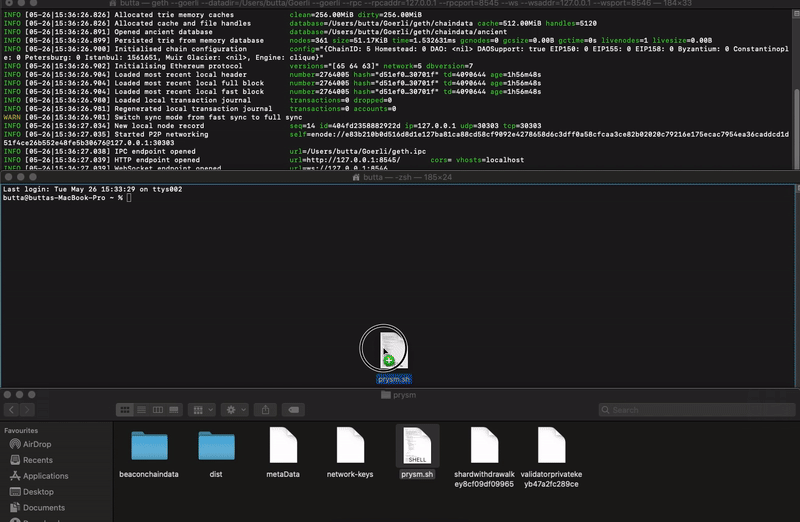
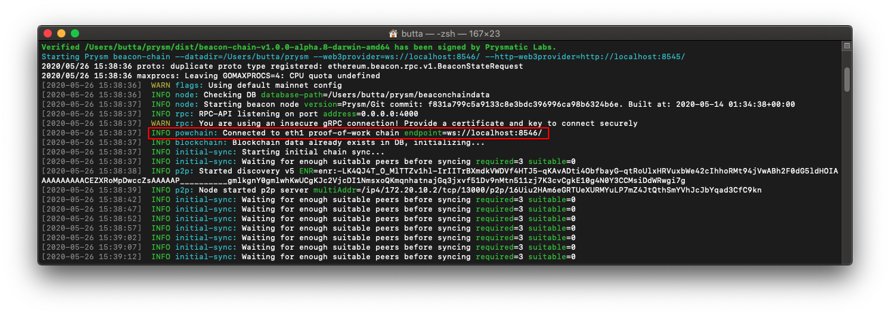

# Run a Goerli node (ETH1) & beaconnode (ETH2)

## General

Ethereum 2.0 Testnets have been running for some time, and because the existing Ethereum 2.0 clients have always provided an Ethereum 1.0  node to users, misunderstandings arose.\
\
**In order to run a validator, an Ethereum 1.0 node must run parallel to Ethereum 2.0 to stay fully decentralized!** \
****However, an Ethereum 1.0 node is not required if you do not want to stake. Without an Ethereum 1.0 node  syncing Ethereum 2.0 blocks is still possible and also being a reliable peer for others in the network.\

.png>)

****\
****_**Goerli-chain size is around 5GB.**_

## **Connect to your** _local_  **ETH1 node**

#### Step 1.

Download [Geth](https://geth.ethereum.org/downloads/)****\
****

#### **Step 2.**&#x20;

Find the downloaded file **and** open a **command prompt/terminal **_****_ window

****

#### **Step 3. Syncing Goerli**

\
Drag and drop the _**geth**_ file into the terminal window and add the following \
`--goerli --datadir="$HOME/Goerli" --rpc --rpcaddr=127.0.0.1 --rpcport=8545`

.png>)

The syncing-process takes about **30 minutes.** **Wait for this to complete.**\
****Once your Goerli node is synced, it should look like this and include the message:\
\
`Imported new chain segment`

.png>)

#### **Step 4. Connect your beaconnode (ETH2) to Goerli (ETH1)**

**While Goerli is in sync**, drag and drop the _**prysm.sh (macos) /prysm.bat (windows)**_ into the terminal window file and add: **** \
****\
**** `beacon-chain  --datadir=$HOME/prysm --web3provider=ws://localhost:8546/ --http-web3provider=http://localhost:8545/`


**--datadir=$HOME/prysm**`Please adapt the path above to your existing beaconchain.db file.` \
`For simplicity reasons we will use $HOME/prysm.`


If the beaconnode **successfully connects** to the local Goerli node, the following message will appear&#x20;

### Essential commands

**Goerli**

`--goerli --datadir="$HOME/Goerli" --rpc --rpcaddr=127.0.0.1 --rpcport=8545 --ws --wsaddr=127.0.0.1 --wsport=8546`

**Beaconnode**

`--datadir=$HOME/prysm --web3provider=ws://localhost:8546/ --http-web3provider=http://localhost:8545/`

## Infura as an ETH 1.0 node

####

#### 1. Sign up on [Infura](https://infura.io/)

#### 2. Create a project with any name

.png>)

3\. Change `Endpoints: Mainnet` to `Goerli`

**That's it!** \
Copy your Project ID URL and run the beacon-node with \
`./prysm.sh beacon-chain --http-web3provider=`**`https://goerli.infura.io/v3/YOUR-PROJECT-ID`**

.png>)

****\
**Confirmation via beacon-node**

.png>)

