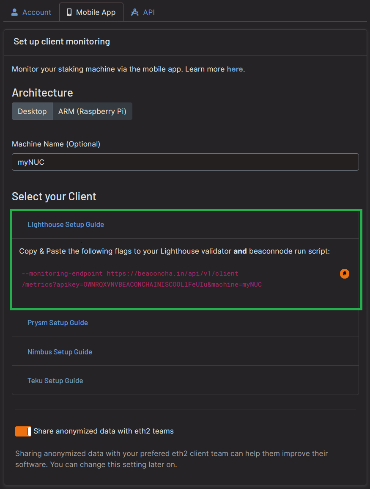
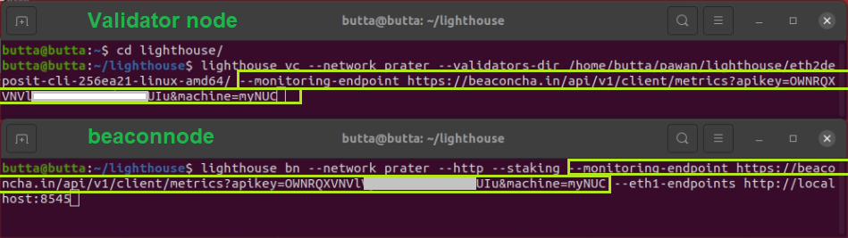
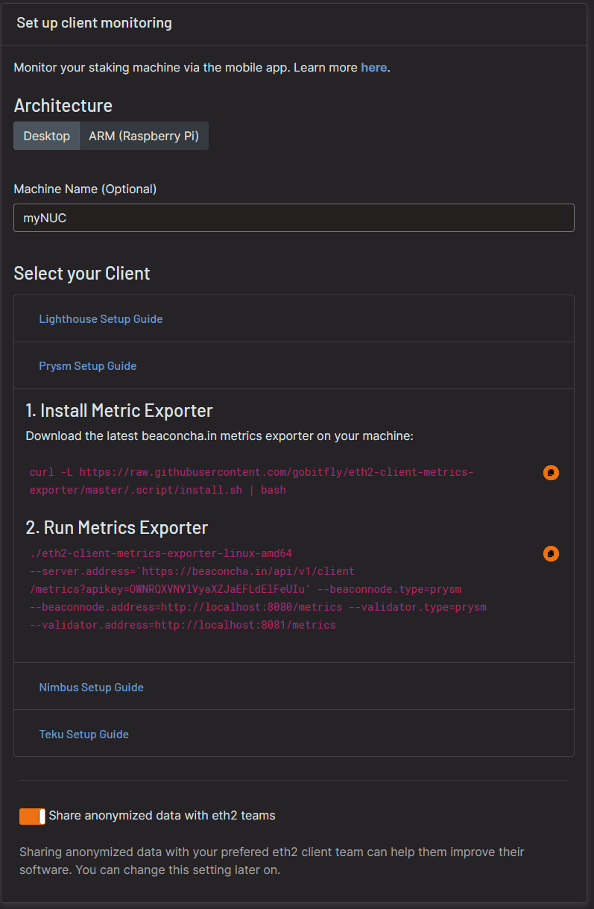
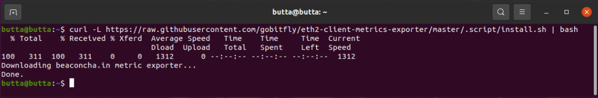
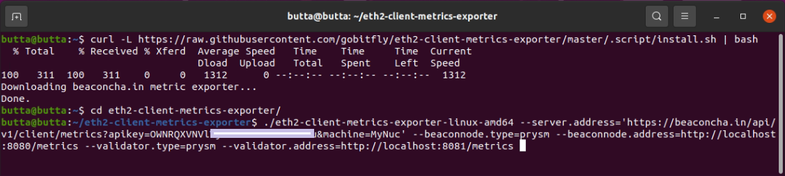
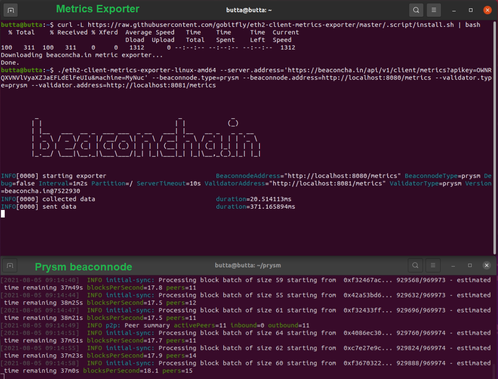
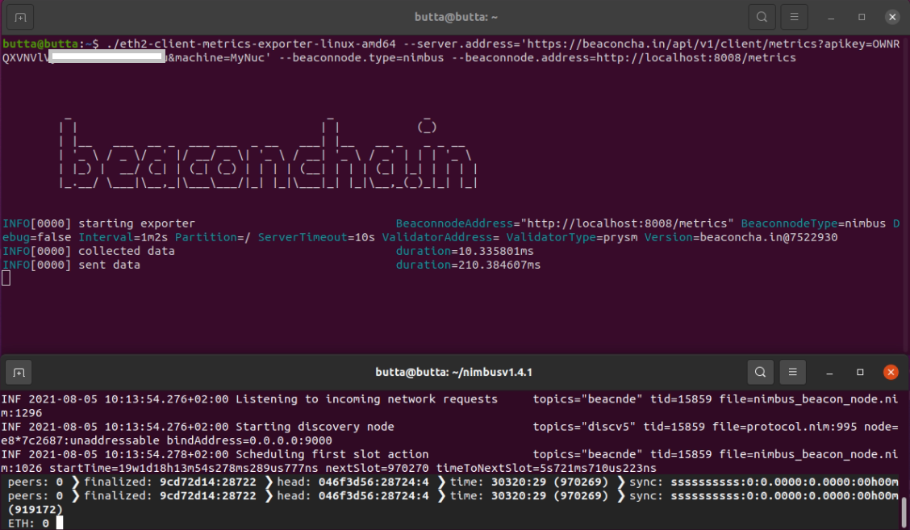
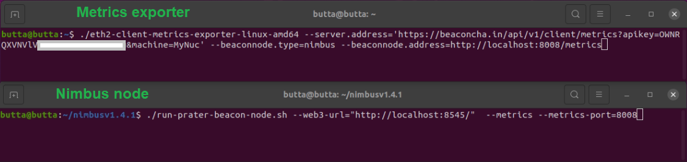

# Mobile App &lt;&gt; Node Monitoring

## General

This is a free monitoring tool provided by [beaconcha.in](https://beaconcha.in/) to enhance the solo staking experience. The user specifies the monitoring endpoint on its beacon & validator node.

_By using this endpoint, beaconcha.in will be allowed and is required to store the given data to display it in the beaconcha.in the mobile application. To protect user privacy, the IP address will **never** be stored._

### **Requirements**

* beaconcha.in [Account](https://beaconcha.in/register) 
* beaconcha.in [Mobile App](https://beaconcha.in/mobile) 
* **Lighthouse**  [**v.1.4.0**](https://github.com/sigp/lighthouse/releases) or higher
* **Prysm** [**v1.3.10**](https://github.com/prysmaticlabs/prysm/releases) or higher
* Staking on Linux \(No windows support by clients yet!\)


**Please adjust the network on the beaconcha.in browser and mobile app accordingly.**


Both, the beaconcha.in [explorer](https://github.com/gobitfly/eth2-beaconchain-explorer) and the [mobile app](https://github.com/gobitfly/eth2-beaconchain-explorer-app) are open source!

## Lighthouse

_A step by step guide on the Prater Testnet. Please adjust the network for your own needs._

1. Open the [**Mobile App** ](https://beaconcha.in/user/settings#app)Tab and enter a name for your staking setup.   _Use the same worker name even if your beaconnode runs on a seperate machine than your validator node._  Copy the generated flag and paste it add it to your **beacon & validator node** __

_If your beacon-node or Ethereum 1.0 node is not in sync yet, you will see some warning logs!_

  
2. Open the [beaconcha.in mobile app](https://beaconcha.in/mobile) and login with your account under _Preferences._    
Your staking device will appear under _Machines_ !  

## Prysm

1. Head over to the [beaconcha.in settings](https://beaconcha.in/user/settings#app) and open the prysm section:

2. Open a **new Terminal** and copy paste the commands

3. Make sure your Prysm client \(beacon & validator\) is already up and running. The exporter will now send the data to your mobile app!

4. Wait a few minutes and open the [beaconcha.in mobile app](https://beaconcha.in/mobile) and login with your account under _Preferences._    
  
Your staking device will appear under _Machines_ !  

## Nimbus

1. Head over to the [beaconcha.in settings](https://beaconcha.in/user/settings#app) and open the nimbus section:

2. Add `--metrics --metrics-port=8008` to your nimbus client! Otherwise the exporter will not be able to get any data from your client.

3. Wait a few minutes and open the [beaconcha.in mobile app](https://beaconcha.in/mobile) and login with your account under _Preferences._    
  
Your staking device will appear under _Machines_ !  

## Teku

Support to be added!

