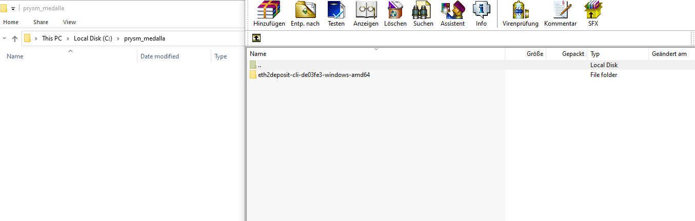
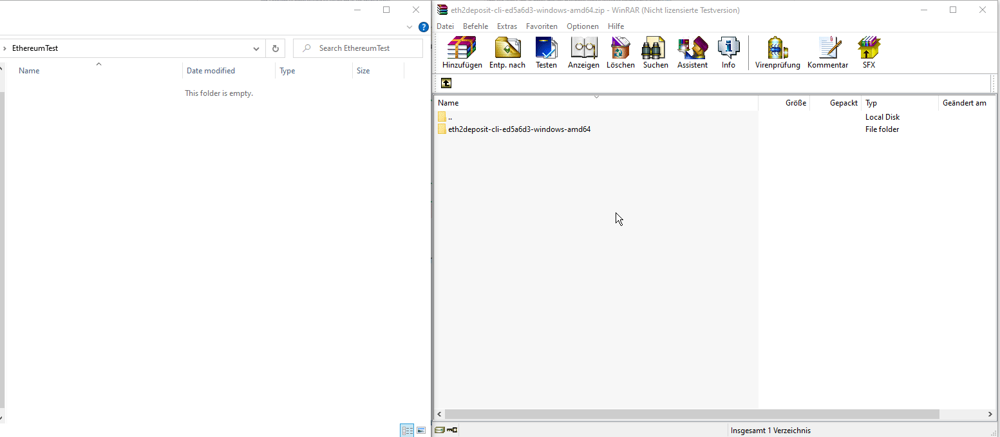
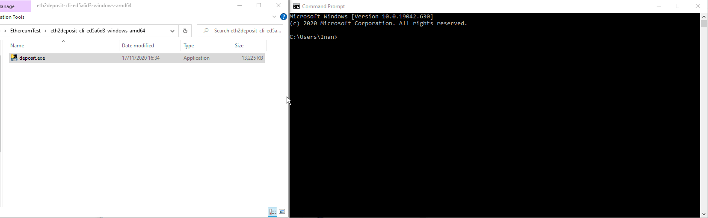
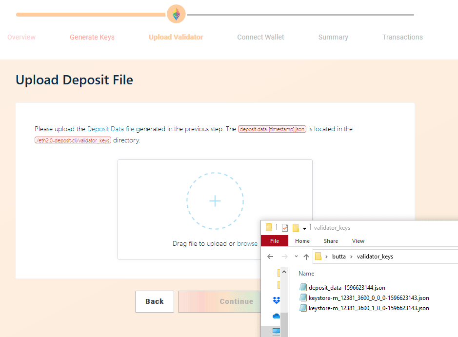
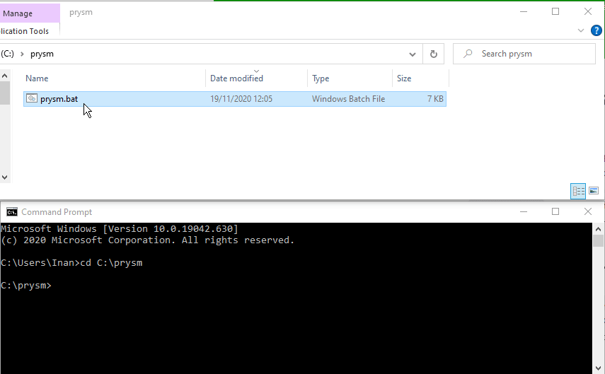
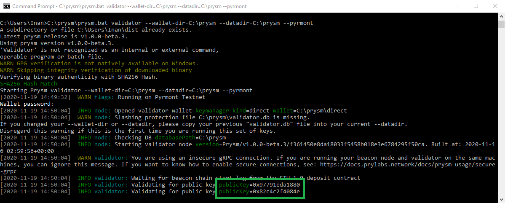
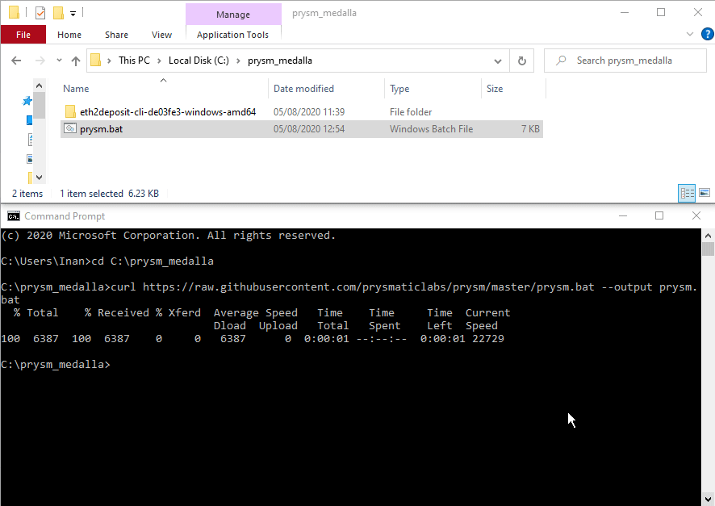
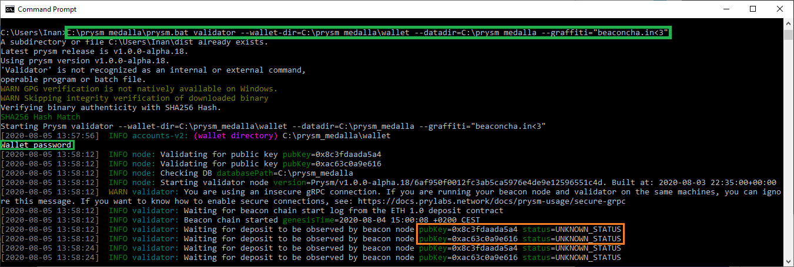

# Pyrmont Testnet: Prysm Client - Windows

## Disclaimer

The following steps only apply for the [**Medalla Testnet**](https://beaconcha.in/) and may be outdated in a few weeks as Ethereum 2.0 clients develop rapidly, however, we will try to keep these documents updated.  
There are multiple ways on how to get started, we will use the one which is the easiest as of now.    
  
[Official Prysm docs](https://docs.prylabs.network/docs/getting-started)  
[Prysmatic labs discord server](https://discord.gg/wJW7Rjk)

## [Official **Pyrmont** Launchpad](https://pyrmont.launchpad.ethereum.org/)

Let's use the launchpad to generate Ethereum 2.0 validator keys and to deposit 32 **Goerli** ETH.

#### 1. Step

**Download** the **latest** Eth2.0-deposit-cli [here](https://github.com/ethereum/eth2.0-deposit-cli/releases/) to generate keys.

**Create** a folder named **prysm\_medalla** in **C:\** and **move** the downloaded file into **C:\prysm\_medalla**.

##  **Choosing Eth1 & Eth2 clients**

Head over to ****the [Pyrmont launchpad](https://pyrmont.launchpad.ethereum.org/)  
Choose **Geth as your Eth 1** client and in the next step choose **Prysm as your Eth 2 client.**

## **Start Ethereum 1.0 Node**

asd

## **Generate Key Pairs**

Choose the amount of validators you would like to run and Windows as the operating system.  
Each validator will cost 32 Goerli ETH.  
  
**Request** Goerli Eth from the r/ethstaker discord [here](https://discord.gg/3fAHvPD) or in the prysmatic labs discord [here](https://discord.gg/gmSMfrF).

## Creating keys

Download the [**eth2.0-deposit-cli**](https://github.com/ethereum/eth2.0-deposit-cli)

**Create** a new folder named **prysm\_pyrmont** and **move** the downloaded file into **prysm\_pyrmont**.

**Open a Terminal window** and drag&drop the **deposit.exe** file into the terminal as shown below.  
Follow the instructions to create your Ethereum 2.0 keys!  
**Drag and drop** the Eth2.0-deposit-cli file and **add** `new-mnemonic --chain pyrmont`

**WRITE DOWN THE GENERATED 24 WORD MNEMONIC PHRASE** 

Let's go to the **next page** and upload our `deposit-data-[timestamp].json` **file** \(located in the path shown in the terminal\)**, continue** and deposit 32 goerli Eth**.**  

## Downloading Prysm


This is only required for the initial setup


#### Open a Terminal window and run: 

1.  `mkdir prysm && cd prysm`  creates a folder named "prysm" 
2. `curl https://raw.githubusercontent.com/prysmaticlabs/prysm/master/prysm.bat --output prysm.bat` Downloads the prysm.bat file 
3. `reg add HKCU\Console /v VirtualTerminalLevel /t REG_DWORD /d 1` Changes some vizulations in the terminal window

## Importing validator keys 

**Drag and drop** the prysm.bat file and **add** `validator accounts import --keys-dir=` **AND** the path to your newly created keys**.** For this example the path is `C:\Users\Inan\validator_keys`

**Which results**   
`prysm.bat validator accounts import --keys-dir=C:\Users\Inan\validator_keys`

**Enter a new wallet directory and a new password.**   
In this example we chose `C:\prysm` as the new wallet directory.

#### **5. Step**

**Download Prysm.bat**  
  
Open a terminal window and type the following  
`cd C:\prysm_medalla`  
  
`curl https://raw.githubusercontent.com/prysmaticlabs/prysm/master/prysm.bat --output prysm.bat`

The **prysm.bat** file will appear in **C:\prysm\_medalla**

#### 6. Step

#### Start the beacon node

**Open** a **command prompt window** and the downloaded **prysm.bat file  
Drag and drop** the **Prysm.bat** file and add `beacon-chain --datadir=C:\prysm_medalla`

**Wait** for the beaconnode to be in sync with the blockchain.   
This may take a few hours and you will see the following message  
  
`Synced new block block=...`

\*\*\*\*

#### **6. Converting Launchpad's Ethereum 2.0 keys** 

_We now need to convert the Launchpad keys into a format that the validator can read.   
There are multiple ways to do this. This guide will use the 24 word Mnemonic phrase \(generated by the launchpad in 3.Step\) to convert the keys to the correct format by using the prysm client._  
  
Open a **new command prompt window**, **drag and drop the prysm.bat file** and add `validator wallet recover`

Followed by the **24 word Mnemonmic phrase**. Afterwards, choose a strong password.  
Set the new wallet directory to `C:\prysm_medalla\wallet` and enter the amount of validators you previously chose.   
  
_The Eth1 Deposit Transaction data, which is required to_ [_deposit_](https://kb.beaconcha.in/ethereum-2.0-and-depositing-process/depositing-to-ethereum-2.0#create-eth-2-0-keys)_, can be **ignored** since this was automatically done on the Launchpad._

#### 7. Step

#### Starting the validator

Again, open a **new command prompt window**, **drag and drop the prysm.bat file** and add   
`validator --wallet-dir=C:\prysm_medalla\wallet --datadir=C:\prysm_medalla --graffiti="beaconcha.in<3"`

Enter your wallet password which was set in the previous step.   
**That's it. We are done!**

Enter your pubkey on the [beaconcha.in](https://beaconcha.in/) to explorer to track its current status and performance.  
_"What does "_[_Unknown status_](https://kb.beaconcha.in/ethereum-2.0-and-depositing-process)_" mean?"_ 

