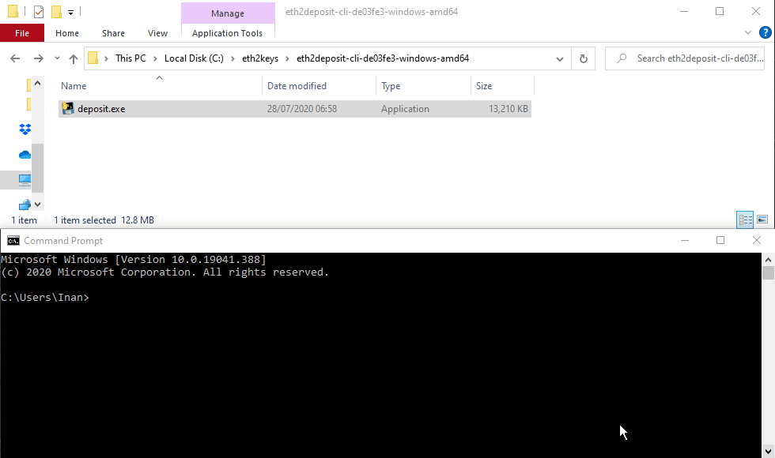

# Medalla Testnet: Prysm Client - Windows

#### Disclaimer

The following steps only apply for the [**Medalla Testnet**](https://beaconcha.in/) and may be outdated in a few weeks as Ethereum 2.0 clients develop rapidly, however, we will try to keep these documents updated.  
There are multiple routes on how to get started, we will use the one which is the easiest as of now. 

#### [Official **Medalla** Launchpad](https://medalla.launchpad.ethereum.org/)

Let's use the launchpad to generate Ethereum 2.0 validator keys and to deposit 32 **Goerli** ETH.

#### 1. Step

**Download** the **latest** Eth2.0-deposit-cli [here](https://github.com/ethereum/eth2.0-deposit-cli/releases/) to generate keys.

**Create** a folder named **prysm\_medalla** in **C:\** and **move** the downloaded file into **C:\prysm\_medalla**.

####  **2.**_**Step**_

**Head over to** the [Medalla launchpad](https://medalla.launchpad.ethereum.org/)  
Skip the overview until you get to **Generate Keys.**

**Generating Keys**  
Choose the amount of validators you would like to run and Windows as the operating system.  
Each validator will cost 32 Goerli ETH.

**Skip** every step until you have to upload the deposit file as shown below.

#### 3. Step 

Generating the validator keys for the launchpad.  
  
**Open** a **command prompt window** and the downloaded **Eth2.0-deposit-cli.  
   
Drag and drop** the Eth2.0-deposit-cli file and add ****`--num_validators 2 --chain medalla`  
Adapt `--num_validators X` to the amount of validators you chose on the launchpad previously.  
  
**WRITE DOWN THE 24 WORD MNEMONIC PHRASE** 

The generated keys are located in `C:\Users\Inan\validator_keys`

#### 4. Step

Import the `deposit-data-[timestamp].json` file to the launchpad and deposit with Metamask.

Once the transactions went through it will look like the following

#### **5. Step**

**Downloading Prysm.bat**  
  
Open a terminal window and type the following  
`cd C:\prysm_medalla`  
  
`curl https://raw.githubusercontent.com/prysmaticlabs/prysm/master/prysm.bat --output prysm.bat`

The **prysm.bat** file will appear in **C:\prysm\_medalla**

#### 6. Step

#### Start the beacon node

**Open** a **command prompt window** and the downloaded **prysm.bat file  
Drag and drop** the **Prysm.bat** file and add `beacon-chain --datadir=C:\prysm_medalla`

**Wait** for the beaconnode to be in sync with the blockchain.   
This may take a few hours and you will see the following message  
  
`Synced new block block=...`

\*\*\*\*

#### **6. Converting Launchpad's Ethereum 2.0 keys** 

_We now need to convert the launchpad keys into a format that the validator can read.   
There are multiple ways to do this. This guide will use the 24 word Mnemonic phrase \(generated by the launchpad in 3.Step\) to conver the keys to the correct format with the prysm client._  
  
Open a **new command prompt window**, **drag and drop the prysm.bat file** and add `validator wallet-v2 recover`

Followed by the **24 word Mnemonmic phrase**. Afterwards, choose a strong password.  
Set the new wallet directory to `C:\prysm_medalla\wallet` and enter the amount of validators you previously chose.   
  
The Eth1 Deposit Transaction data, which is required to [deposit](https://kb.beaconcha.in/ethereum-2.0-and-depositing-process/depositing-to-ethereum-2.0#create-eth-2-0-keys), can be ignored since this was automatically done on the launchpad.

#### 7. Step

#### Starting the validator

Again, open a **new command prompt window**, **drag and drop the prysm.bat file** and add   
`validator --wallet-dir=C:\prysm_medalla\wallet --datadir=C:\prysm_medalla --graffiti="beaconcha.in<3"`

Enter your wallet password which was set in the previous step.   
**That's it. We are done!**

Enter your pubkey on the [beaconcha.in](https://beaconcha.in/) to explorer to track its current status.  
_"What does "_[_Unknown status_](https://kb.beaconcha.in/ethereum-2.0-and-depositing-process)_" mean?"_ 

