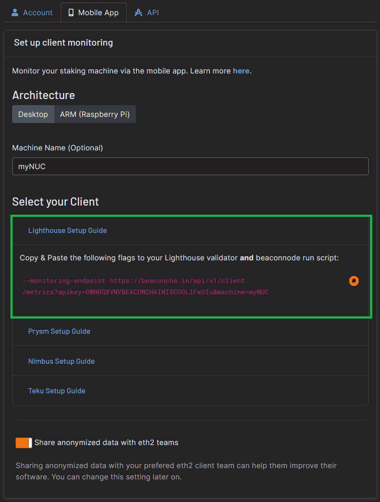
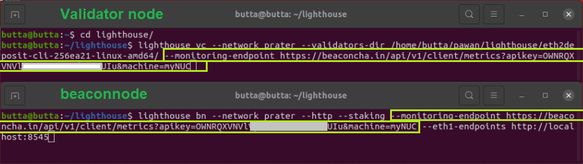
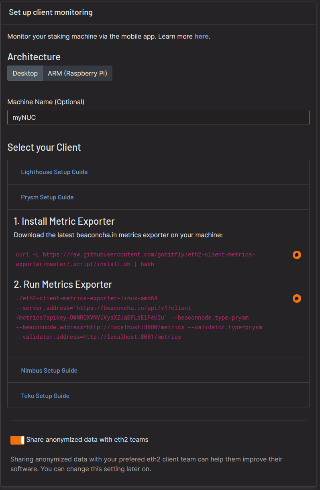
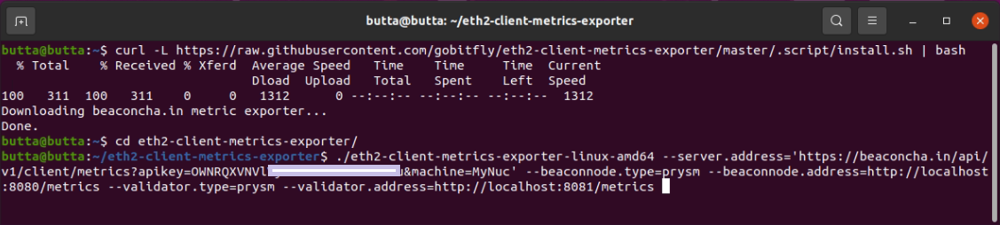
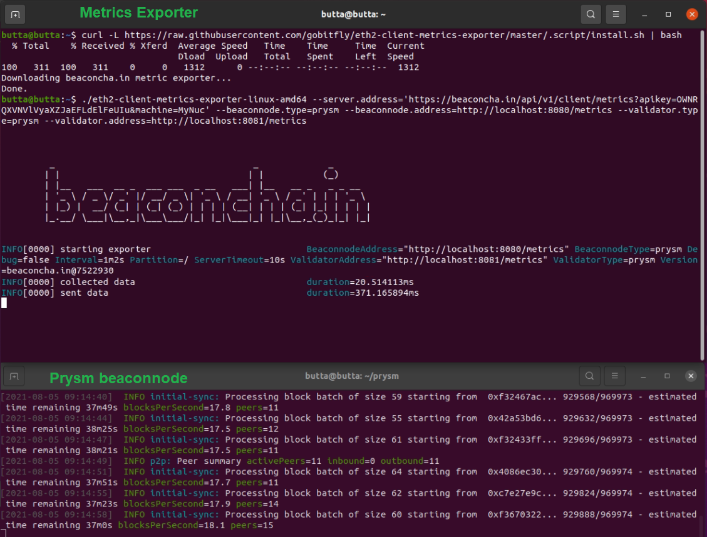
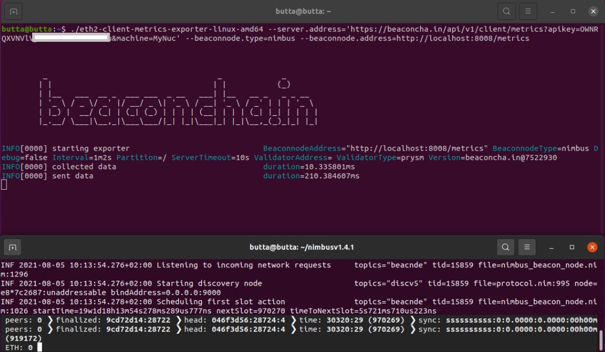
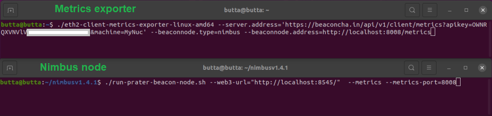

# Mobile App Node Monitoring

## General

This is a free monitoring tool provided by [beaconcha.in](https://beaconcha.in/) to enhance the solo staking experience. The user specifies the monitoring endpoint on its consensus layer and validator node.

<Frame>
  
</Frame>

_By using this endpoint, beaconcha.in will be allowed and is required to store the given data to display it in the beaconcha.in the mobile application. To protect user privacy, the IP address will **never** be stored_

### **Requirements**

* beaconcha.in [Account](https://beaconcha.in/register)
* beaconcha.in [Mobile App](https://beaconcha.in/mobile)
* **Lighthouse** [**v.1.4.0**](https://github.com/sigp/lighthouse/releases) or higher
* **Prysm** [**v1.3.10**](https://github.com/prysmaticlabs/prysm/releases) or higher
* **Nimbus** [**v1.4.1**](https://github.com/status-im/nimbus-eth2/releases) **or higher**
* **Teku v22.3.0 or higher**
* **Lodestar** [**v1.6.0**](https://github.com/ChainSafe/lodestar/releases) **or higher**
* Staking on Linux (No windows support by clients yet!)

<Info>
Please adjust the network on the beaconcha.in browser and mobile app accordingly.
</Info>

Both the beaconcha.in [explorer](https://github.com/gobitfly/eth2-beaconchain-explorer) and the [mobile app](https://github.com/gobitfly/eth2-beaconchain-explorer-app) are open source!

## Lighthouse

_A step-by-step guide on the Prater Testnet. Please adjust the network for your own needs._

1. Open the [**Mobile App** ](https://beaconcha.in/user/settings#app)Tab and enter a name for your staking setup.\
   Use the same worker name even if your consensus layer node runs on a separate machine than your validator node.\
   Copy the generated flag and paste it to your **beacon & validator node**

<Frame>
  
</Frame>

<Frame>
  
</Frame>

_If your consensus layer node or execution layer node is not in sync yet, you will see some warning in the logs!_

\
2\. Open the [beaconcha.in mobile app](https://beaconcha.in/mobile) and login with your account under _Preferences._\
Your staking device will appear under _Machines_!

<Frame>
  
</Frame>

## Prysm

1. Head over to the [beaconcha.in settings](https://beaconcha.in/user/settings#app) and open the prysm section:

<Frame>
  
</Frame>

2\. Open a **new Terminal** and copy and paste the commands

<Frame>
  
</Frame>

3\. Make sure your Prysm client (consensus layer node and validator client) is already up and running. The exporter will now send the data to your mobile app!

<Frame>
  
</Frame>

4\. Wait a few minutes and open the [beaconcha.in mobile app](https://beaconcha.in/mobile) and login with your account under _Preferences._\
\
Your staking device will appear under _Machines_!

<Frame>
  
</Frame>

## Nimbus

1. Head over to the [beaconcha.in settings](https://beaconcha.in/user/settings#app) and open the nimbus section:

<Frame>
  
</Frame>

2\. Add `--metrics --metrics-port=8008` to your nimbus client! Otherwise, the exporter will not be able to get any data from your client.

<Frame>
  
</Frame>

3\. Wait a few minutes and open the [beaconcha.in mobile app](https://beaconcha.in/mobile) and login with your account under _Preferences._\
\
Your staking device will appear under _Machines_!

<Frame>
  
</Frame>

## Teku

Add the following endpoint to your teku node `--metrics-publish-endpoint https://beaconcha.in/api/v1/client/metrics?apikey=YOUR_API_KEY`

You can find your API Key here: [https://beaconcha.in/user/settings#app](https://beaconcha.in/user/settings#app)

## Lodestar

Add the following CLI flag to your Lodestar validator and consensus layer node `--monitoring.endpoint 'https://beaconcha.in/api/v1/client/metrics?apikey=YOUR_API_KEY'`

You can find your API Key in the [account settings](https://beaconcha.in/user/settings#api).

Check out the Lodestar documentation about [client monitoring](https://chainsafe.github.io/lodestar/run/logging-and-metrics/client-monitoring) for further details.

## Monitoring with Rocket Pool
Works with Lighthouse, Lodestar, Teku and Nimbus only.

### Lighthouse, Lodestar and Teku

Add Your [beaconcha.in API key ](https://beaconcha.in/user/settings#app)in Monitoring/Metrics (service config)

<Frame>
  
</Frame>

***

### Nimbus

Nimbus does not expose all tracked data, some metrics such as validators are not visible in the app.

Guide: [https://gist.github.com/jshufro/89e32d417801bf3dfb02c32a983b63cf](https://gist.github.com/jshufro/89e32d417801bf3dfb02c32a983b63cf)
