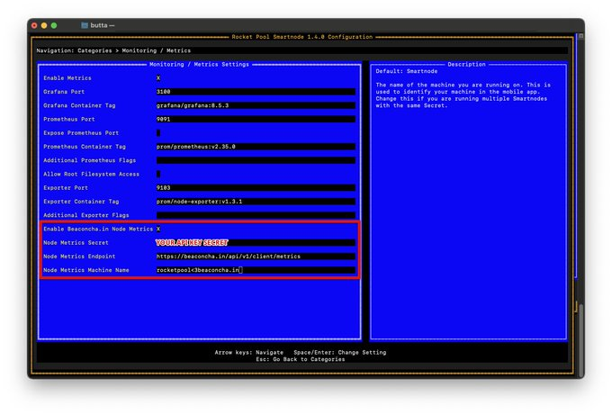

# ⏰ Notifications v2

## Requirements

* beaconcha.in acccount&#x20;
  * Register [here](https://beaconcha.in/register)
  * Login [here](https://beaconcha.in/login)
* Configure notifications [here](https://beaconcha.in/notifications)

<Frame>
  
</Frame>

## Overview

* **A**: Shows whether email notifications are enabled.
* **B**: Daily email limit. The limit resets at 00:00 UTC. Upgrading to a higher [premium](https://beaconcha.in/pricing) tier increases this limit.
* **C**: Indicates whether push notifications for the mobile app are enabled.
* **D**: Notification history. Notifications for dashboards, machines, clients, and network events will appear in dedicated tabs.
* **E**: Set up or manage your notifications in this section.

<Frame>
  
</Frame>

## Setting up v2 notifications via web

### Validator notifications

V2 notifications are group-based, meaning you can set validator notifications for each [group](../validator-dashboard/validator-groups) configured on the [validator dashboard](https://beaconcha.in/dashboard).

To set up notifications:

1. Make sure you have created a [validator dashboard](https://beaconcha.in/dashboard) first.
2. Go to [https://beaconcha.in/notifications#dashboards](https://beaconcha.in/notifications#dashboards).
3. Click on `Manage Notifications`.
4. Ensure email and push notifications are **enabled**.
5. Send a test notification to confirm you receive notifications.
6. Go to the Dashboard tab, select the group, and edit the subscription column.

<Frame>
  
</Frame>

### Validator notifications via webhook

1. Follow the steps in [Validator Notifications](#validator-notifications)
2. Click the Edit icon in the webhook column.
3. Add your webhook URL.
   1. Check the 'Send via Discord' box if notifications should be sent to a [Discord channel](https://support.discord.com/hc/en-us/articles/228383668-Intro-to-Webhooks).
4. Send a test notification to ensure everything is working.
5. Click Save.

<Frame>
  
</Frame>

### Client notifications

To set up notifications for EL and CL clients like Geth, Nimbus, or Erigon, go to the Clients tab.

<Frame>
  
</Frame>

### Network notifications

To set up notifications for Gas prices, Rocket Pool reward round or Participation rate of the network, go to the Networks tab.

<Frame>
  
</Frame>

## Migrating from v1 notification to v2

<Tip>
NOTE: This method works for up to 100 validators for free users and up to 280 for premium users! Users exceeding this limit, please continue from 4.&#x20;
</Tip>

1. Head over to [https://beaconcha.in/user/notifications](https://beaconcha.in/user/notifications)
2.  Scroll down and click "View Stats"

    <Frame>
      
    </Frame>

3. Copy the validator indices from the URL of the website that opens:\
   e.g `1,2641,2642,2643,2645,3288,3292,3400,3401,3402,3403,3404`

<Frame>
  
</Frame>

4. Login on [https://beaconcha.in/login](https://beaconcha.in/login), and create a v2 dashboard here: [https://beaconcha.in/dashboard](https://beaconcha.in/dashboard)\

5. Click on `Manage Validators`and add your validators as a comma-separated list or use other methods as described in [#bulk-adding-to-the-validator-dashboard](../validator-dashboard/manage-validators#bulk-adding-to-the-validator-dashboard "mention"):

<Frame>
  
</Frame>

With the dashboard successfully set up, you can configure notifications. :relaxed:

6. Go to [https://beaconcha.in/notifications#dashboards](https://beaconcha.in/notifications#dashboards).
7. Click on `Manage Notifications`.
8. Ensure email and push notifications are **enabled**.
9. Send a test notification to confirm you receive notifications.
10. Go to the Dashboard tab, select the group, and edit the subscription column.

<Frame>
  
</Frame>

