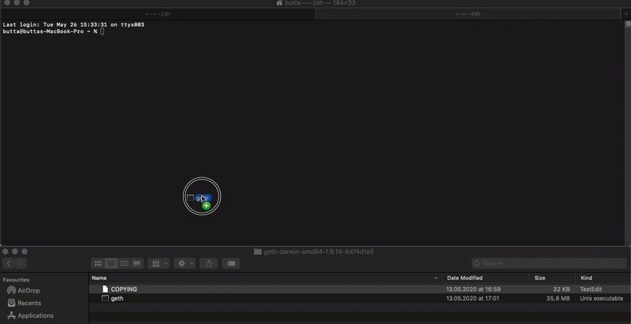

# Run a Goerli node \(ETH1\) & beaconnode \(ETH2\)

## General

Ethereum 2.0 Testnets have been running for some time, and because the existing Ethereum 2.0 clients have always provided an Ethereum 1.0  node to users, misunderstandings arose.  
  
**To clear things up:   
If you want to run a validator, an Ethereum 1.0 node must run parallel to Ethereum 2.0 to stay fully decentralized!** 

**However, an Ethereum 1.0 node is not required if you do not want to stake. Without an Ethereum 1.0 node you will still be able to sync Ethereum 2.0 blocks and be a realiable peer for others in the network.**  
  
_The following steps only work if the beaconnode is on the **same** machine as the Goerli node.  
**Goerli-chain size is around 5GB.**_

## **How to connect your ETH2 beaconnode to your** _local_  **ETH1 node**

#### Step 1.

Download [Geth](https://geth.ethereum.org/downloads/)  
****

#### **Step 2.** 

Find the downloaded file **and** open a **command prompt/terminal** _****_window

\*\*\*\*

#### **Step 3. Syncing Goerli**

  
Drag and drop the _**geth**_ file into the terminal window and add the following   
  
 `--goerli --datadir="$HOME/Goerli" --rpc --rpcaddr=127.0.0.1 --rpcport=8545 --ws --wsaddr=127.0.0.1 --wsport=8546`

  
The syncing-process takes about **30 minutes.** **Wait for this to complete.**  
Once your Goerli node is synced, it should look like this and include the message:  
  
`Imported new chain segment`

#### **Step 4. Connect your beaconnode \(ETH2\) to Goerli \(ETH1\)**

**While Goerli is in sync**, drag and drop the _**prysm.sh \(macos\) /prysm.bat \(windows\)**_ into the terminal window file and add:   
  
**** `beacon-chain  --datadir=$HOME/prysm --web3provider=ws://localhost:8546/ --http-web3provider=http://localhost:8545/`


**--datadir=$HOME/prysm**`Please adapt the path above to your existing beaconchain.db file.   
For simplicity reasons we will use the one above.`


If the beaconnode **successfully connects** to the local Goerli node, the following message will appear 

## TL;DR

**Goerli**

`--goerli --datadir="$HOME/Goerli" --rpc --rpcaddr=127.0.0.1 --rpcport=8545 --ws --wsaddr=127.0.0.1 --wsport=8546`

**Beaconnode**

`--datadir=$HOME/prysm --web3provider=ws://localhost:8546/ --http-web3provider=http://localhost:8545/`

