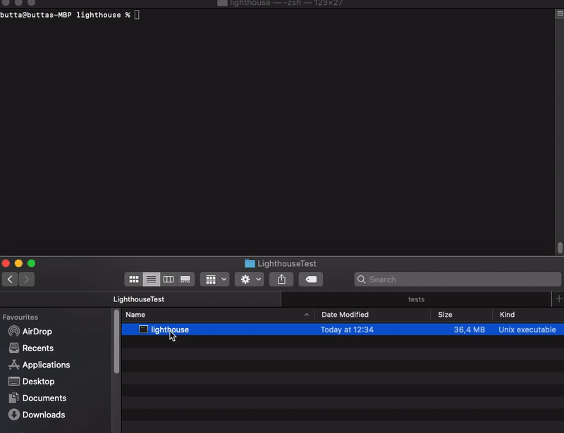

# Beaconnode & validator with macOS

[Official Lighthouse docs  
](https://lighthouse-book.sigmaprime.io/become-a-validator-source.html)[Lighthouse Discord server](https://discord.gg/8mFMS7G)

#### Requirements:  A running Goerli node \([Guide](https://kb.beaconcha.in/run-a-goerli-node-eth1-and-beaconnode-eth2#step-1) till step 3.\)

#### 

#### 1. Step 

#### Installing Rust

Open a terminal window and paste the following in:

`curl --proto '=https' --tlsv1.2 -sSf https://sh.rustup.rs | sh`

_"Current installation options"_  
Press **"1"** and confirm with Enter.

_"Next time you log in this will be done automatically"_  
**Close** this terminal window and **open a new one.**

#### 2. Downloading and building Lighthouse

`git clone https://github.com/sigp/lighthouse.git  
cd lighthouse`

and then run `make`

_Wait a few minutes_  
Once the process is done it will look like the following

#### 3. Get the built binary file

Open **Finder** and head over to `~/.cargo/bin/`

**Copy** the Lighthouse file to a more convenient folder.

#### 4. Start the beacon-node

Drag and drop the **Lighthouse** file and add `bn --eth1-endpoint http:127.0.0.1:8545 --http`

#### 

