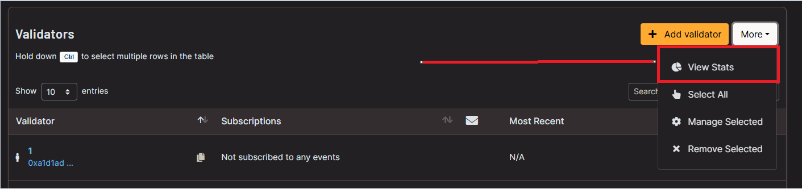

# Run with macOS using Docker

####  [Official **PrysmaticLabs Docs**](https://docs.prylabs.network/docs/getting-started/)\*\*\*\*

#### Step 0. 

[Install docker ](https://docs.docker.com/docker-for-mac/install/)

**Step 1.**

Check if **Docker** is installed through the terminal.   
This can be done by pressing `CMD+Space` and searching for **Terminal**.

Run `docker -v` .  
If the output returns the docker version, Docker is installed correctly.

\*\*\*\*

**Step 2.**

**Download and install latest beaconchain updates**

`docker pull gcr.io/prysmaticlabs/prysm/beacon-chain:latest`

**Download and install latest validator updates**

`docker pull gcr.io/prysmaticlabs/prysm/validator:latest`

**Start the beaconnode**

`docker run -it -v $HOME/prysm:/data -p 4000:4000 -p 13000:13000 --name beacon-node \gcr.io/prysmaticlabs/prysm/beacon-chain:latest  --datadir=/data`

The directory `$HOME/prysm` contains all the beaconchain data and can be accessed through **Finder.**

**Wait** for the beaconnode to be in sync with the blockchain.   
This may take a few hours and you will see the following message:

`INFO initial-sync: Synced up to slot XXXXX`

\*\*\*\*

**Step 3.**

**Create ETH2 Keys**

Open a **new Terminal** window and run:

`docker run -it -v $HOME/eth2validator:/data gcr.io/prysmaticlabs/prysm/validator:latest accounts create --keystore-path=/data --password=yourPassword`


The created Keys are now located in **$HOME/eth2validator** 


**Copy the Raw Transaction Data** and go to the [participation page](https://prylabs.net/participate).  
Some of the instructions on the participation page will be ignored because they are not required anymore. 

Follow the steps below to get Goerli ETH and to deposit them ****to activate your validator. If you cannot get any Goerli ETH through the participation page, join the [Prysm Discord](https://discord.gg/wJW7Rjk) channel.

\*\*\*\*

**Step 4.**

**Start the validator**

Open a **new Terminal** window and run:

`docker run -it -v $HOME/eth2validator:/data --network="host" gcr.io/prysmaticlabs/prysm/validator:latest --beacon-rpc-provider=127.0.0.1:4000 --keystore-path=/data --password=yourPassword`

\*\*\*\*

**Step 5.**

Track your validator performance on [beaconcha.in](https://beaconcha.in/dashboard?validators=) with your public key \(orange\).   
Once the blockchain recognises the deposit, the [beaoncha.in](https://beaconcha.in/) explorer will allow you to track the validator more accurately.

Wait for the inclusionSlot \(red\) to be reached. Once the blockchain has processed this slot, you will be staking! The Slot number can be tracked [here](https://beaconcha.in/blocks).

\*\*\*\*

**Running multiple validators** 

Repeat **Step 3.** and **create more keys** into the same directory.   
**Use the same password for all keys.**

Copy the **Raw Transaction Data** for each validator, re-do the process on the [participation page](https://prylabs.net/participate) and deposit for each of them.

Once the system has received all deposits, you can just start a single validator "window", and it will use **all** of the created keys \(=multiple validators\).

