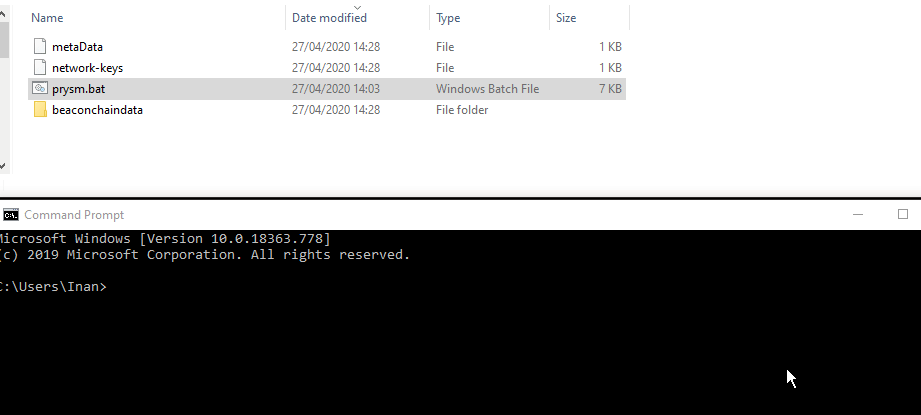
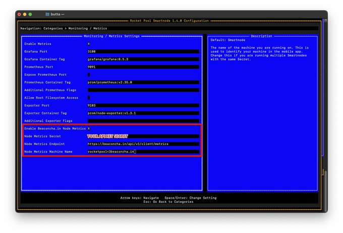
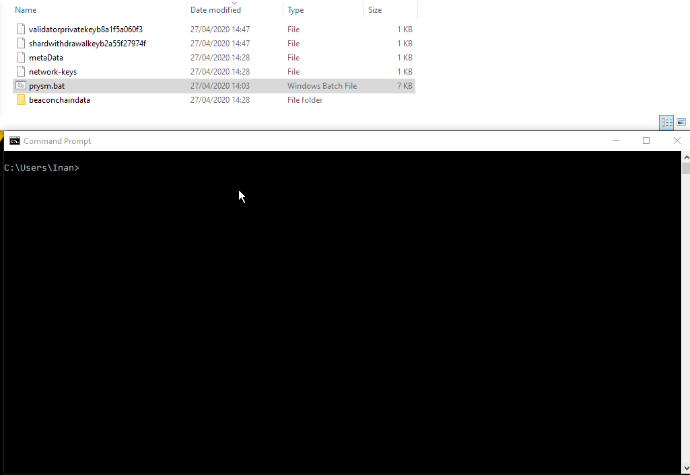

# Run with Windows using Prysm.bat

####  [Official **PrysmaticLabs Docs**](https://docs.prylabs.network/docs/getting-started/)\*\*\*\*

#### Step 0.

Create a folder named **prysm** in the **C:\** directory. 

\*\*\*\*

**Step 1.**

Enter the following code into the **command prompt window**:

`cd C:\prysm`  and then follow up with**:**   
  
`curl https://raw.githubusercontent.com/prysmaticlabs/prysm/master/prysm.bat --output prysm.bat`

The **prysm.bat** file should appear in the **C:\prysm** directory.

\*\*\*\*

**Step 2.**


 **This Step is not required. This command fixes the cosmetics of the command prompt.**


Use the following code:

`reg add HKCU\Console /v VirtualTerminalLevel /t REG_DWORD /d 1`

\*\*\*\*

**Step 3.** 

**Start the beaconnode**  
  
Drag and drop the **prysm.bat** file into the command prompt window and add:  
   
`beacon-chain --datadir=C:\prysm`

**Wait** for the beaconnode to be in sync with the blockchain.   
This may take a few hours and you will see the following message:

`INFO initial-sync: Synced up to slot XXXXX`

\*\*\*\*

**Step 4.**

**Create ETH2 keys**

Drag and drop the **prysm.bat** file into the command prompt window and add:  
  
`validator accounts create --keystore-path=C:\prysm --password=yourPassword`

**Copy the Raw Transaction Data** and go to the [participation page](https://prylabs.net/participate).   
Some of the instructions on the **participation page** will be ignored because they were not optimized for Windows10 \(yet\).  
  
Follow the steps below to get Goerli ETH and to deposit them to activate your validator. If you cannot get any Goerli ETH through the participation page, join the [Prysm Discord](https://discord.gg/wJW7Rjk) channel.

\*\*\*\*

**Step 5.**

**Start the validator**

Drag and drop the **prysm.bat** file into **a seperate** command prompt window **while the beaconnode is running in a different command prompt window** and add:

`validator --keystore-path=C:\prysm --password=yourPassword`

\*\*\*\*

**Step 6.**

Track your validator performance on [beaconcha.in](https://beaconcha.in/dashboard?validators=) with your public key \(orange\).   
Once the blockchain recognizes the deposit, the [beaoncha.in](https://beaconcha.in/) explorer will allow you to track the validator more accurately.

Wait for the inclusionSlot \(red\) to be reached. Once the blockchain has processed this slot, you will be staking! The Slot number can be tracked [here](https://beaconcha.in/blocks).

\*\*\*\*

**Running multiple validators** 

Repeat **Step 4.** and **create more keys** into the same directory.   
**Use the same password for all keys.**

Copy the **Raw Transaction Data** for each validator, re-do the process on the [participation page](https://prylabs.net/participate) and deposit for each of them.

Once the system has received all deposits, you can just start a single validator window, and it will use **all** of the created keys \(=multiple validators\).

