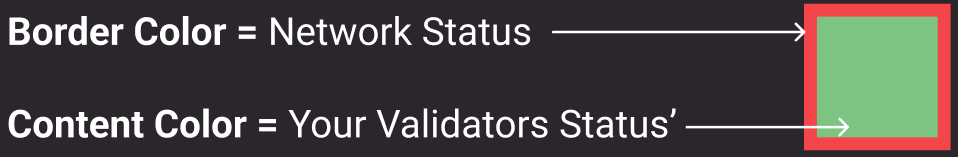
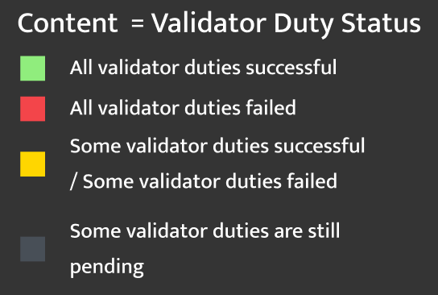
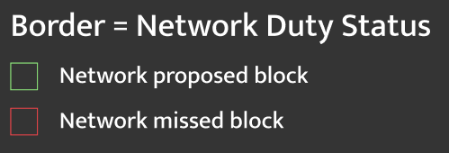
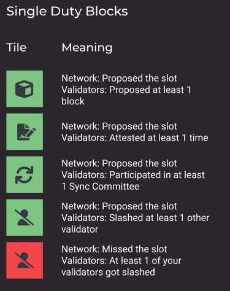
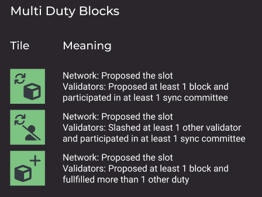
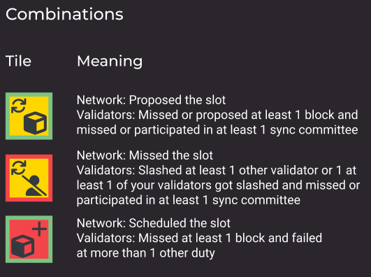

# 🟩 Slot visualization

The slot viz has been redesigned and integrated into the dashboard to visualize real-time data for the user's validator set.&#x20;

A multi-color scheme has been introduced to simplify issue detection and allow preperation for upcoming validator duties for operators. This significantly enhances user experience, as users no longer need to read and switch between data tables.

<Frame caption="Slot viz overview">
    
</Frame>

Users that run hundreds of validators can reduce the noise in their slot viz using the filters located in the top left corner 🙂

<Frame caption="Filtering duties in the slot viz">
    
</Frame>

***

### **How does it work?**

Each block has two states. The network status and the users' validator status.&#x20;

This makes it easy to backtrack if a missed duty was related to network issue.

#### **Content Color Scheme**

#### Border Color Scheme

#### **Examples**

***

