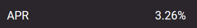
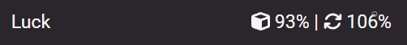

# 🦸 Summary view

The summary table is part of the [validator dashboard](https://beaconcha.in/dashboard). It provides detailed performance metrics for each validator [group](./validator-groups), including [efficiency](#efficiency) and validator rewards across various time frames. It also features a [historical chart view](#summary-chart-view).

***

## Overview

Each row in the summary table represents a [validator group](./validator-groups). Users with multiple groups will see an additional row above the thin orange line, labeled as the Σ-row.

<Frame>
  
</Frame>

### Expandable rows

Expanding a row provides detailed data for each group.

<Frame>
  
</Frame>

### Absolute vs relative values

The summary table can be viewed in both absolute and relative values. This feature is especially useful for large entities with millions of attestations that prefer a relative value.

<Frame>
  
</Frame>

1. **Summary table with relative values**

<Frame caption="Summary table with relative values">
  
</Frame>

2. **Summary table with absolute values**

<Frame caption="Summary table with absolute values">
  
</Frame>


### Missed Rewards Calculation

When a validator misses rewards — whether from the Consensus Layer (CL) or Execution Layer (EL) proposals, including MEV — those missed rewards are calculated using the median (p50) of the surrounding rewards. Specifically:

1. **Identify the Surrounding Slots**
   * For each missed slot, consider the 32 slots surrounding it: slots where `slot >= missed.slot - 16` AND `slot < missed.slot + 16`
2. **Calculate the Median (p50)**
   * Collect the rewards from each of those surrounding 32 slots.
   * Compute the _median_ (50th percentile, or p50) of that set of rewards.

3. **Assign the Median as the Missed Reward**
   * The resulting median value becomes the _missed reward_ for that specific slot.


<Frame>
  
</Frame>

#### Example

* Suppose a missed proposal occurred at slot `100`.
  * Look at slots `84` through `115` (i.e., `100 - 16` to `100 + 15`).
  * Gather each validator’s reward (MEV rewards + CL rewards) from those slots.
  * Sort these rewards and take the median value.
  * The median is then recorded as the missed reward for slot `100`.


## APR calculation

The APR is calculated based on the growth rate of your consensus layer (CL) staking balance over the selected period, using epoch-level granularity. At the start of the period, the total CL balance across all validators is recorded. The total rewards earned during the period are divided by this starting balance to determine the period growth rate. This rate is then annualized by scaling to one year.

`APR = (RewardsInPeriod / BalanceAtPeriodStart) * (EpochsPerYear / EpochsInPeriod) * 100`&#x20;

* **BalanceAtPeriodStart**: Sum of all validator CL balances at the start of the period.
* **RewardsInPeriod**: Total rewards accrued by those validators during the period.
* **EpochsInPeriod**: Number of epochs in the selected period (each epoch is \~6.4 minutes).
* **EpochsPerYear**: Total number of epochs in a year (≈51,480).

<Warning>
The All time period currently shows the 90-day APR. This is subject to change in the future.
</Warning>

<Frame>
  
</Frame>

## Luck calculation

<Frame>
  
</Frame>

Validators are randomly selected for duties, such as proposing blocks or participating in the sync committee. The chance of being assigned duties depends on the total number of validators on the network and their effective balance.

<Info>
Luck values are purely informative and cannot be actively influenced.
</Info>

**Blocks**

1. It is calculated how likely a validator was to be chosen to propose a block in each epoch.

```
ExpectedBlocks = (ValidatorEffectiveBalance / NetworkEffectiveBalance) * SlotsPerEpoch
```

2. The number of blocks a validator proposed is measured against the expected number, expressed as a percentage.

```
BlockLuckPercent = (ProposedBlocks / ExpectedBlocks) * 100
```

In practice, this calculation is performed for all validators over the selected time frame.

**Sync Committee**

1. It is calculated how likely it was for a validator to be chosen as a member of the sync committee in each election.

```
ExpectedSyncParticipations = (ValidatorEffectiveBalance / NetworkEffectiveBalance) * SyncCommitteeSize
```

2. The number of actual participations is compared to the expected participations and expressed as a percentage.

```
SyncLuckPercent = (ActualSyncParticipations / ExpectedSyncParticipations) * 100
```

In practice, this calculation is performed for all validators over the selected time frame.

## Summary chart view

`[1]` View the historical performance of your validator groups by clicking this button and switching to the summary chart view.

<Frame>
  
</Frame>

`[2]` The summary chart view is perfect for debugging issues, as it provides historical performance data with epoch-level granularity. The Groups dropdown lets users filter specific groups, while the Total line (orange line) shows the average performance of all groups in the dashboard.\
\
To identify missed blocks, sync duties, or attestations, users can use the Efficiency dropdown to filter for those specific duties.

<Frame>
  
</Frame>

## Status column

The status column offers a quick way to check key duties, such as your current sync committees, whether you're part of the upcoming sync committee, and if any of your validators have been slashed.\
\
Hover over the icons for more details.

<Frame>
  
</Frame>

## Validator column

The validator column displays the state of each validator in each group:

* Online validators (green icon)
* Offline validators (red icon)
* Exited validators (gray icon)

A comma-separated list of validator indices for each group can be found in the popout modal for each row in the table.

<Frame caption="Validator states">
  
</Frame>

<Frame caption="Validators state in relative values">
  
</Frame>

_The relative value only accounts for online and offline validators, ignoring those that have already exited the chain. This offers quick insights into whether your group is experiencing issues._

<Frame caption="Popout modal with comma separated validator indices">
  
</Frame>

## Efficiency

The Validator [Efficiency](#efficiency) metric is a new, comprehensive measure of validator performance, combining multiple components:

* **Red arrow**: Underperforming the network average by at least 0.25%.
* **Green arrow**: Outperforming the network average by at least 0.25%.
* **Yellow arrow**: Within a range of +/- 0.25% of the network average.

Hovering over an arrow displays the exact performance of each group. For historical performance, switch to the summary chart view.

<Frame>
  
</Frame>

### Attestations vs Attester efficiency

* **Attester Efficiency**: This measures how much reward a validator could have earned for attestations versus how much they actually earned. For example, if a validator could have earned 100 GWEI for attestations but only received 98 GWEI, the attester efficiency would be 98%.
* **Attestations (%-value)**: This represents the percentage of attestations successfully included in the network. For instance, if a validator managed to include 99 out of 100 attestations, the Attestation (%) value would be 99%.

The absolute values can be viewed by hovering over this percentage or by switching to the absolute-table view.

<Frame>
  
</Frame>
